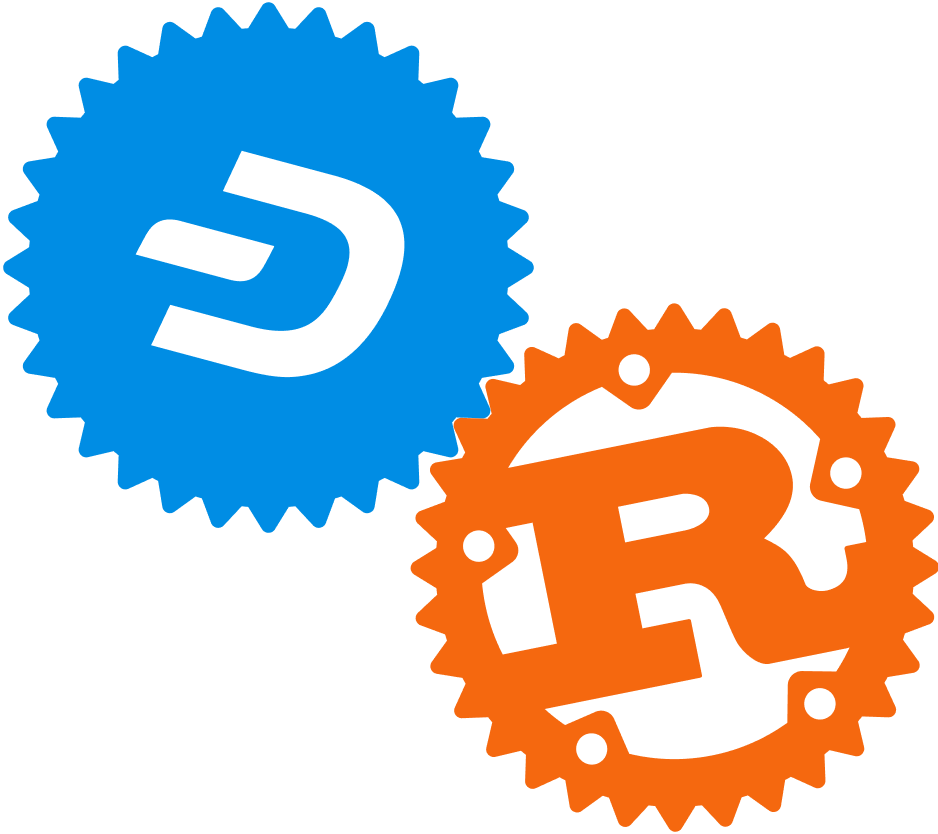

<div align="center">
  <h1>Rust Dash</h1>

  

  <p>Library with support for de/serialization, parsing and executing on data-structures
    and network messages related to Dash Core payment chain.
  </p>

  <p>
    <a href="https://crates.io/crates/dash"></a>
    <a href="https://github.com/dashevo/rust-dashcore/blob/master/LICENSE"></a>
    <a href="https://github.com/dashevo/rust-dashcore/actions?query=workflow%3AContinuous%20integration"></a>
    <a href="https://docs.rs/bitcoin"></a>
    <a href="https://blog.rust-lang.org/2018/09/13/Rust-1.29.html"></a>
    
  </p>
</div>

**Heads up for contributors: upcoming edition change**

[Documentation](https://dashcore.readme.io/docs)

Supports (or should support)

* De/serialization of Dash protocol network messages
* De/serialization of blocks and transactions
* Script de/serialization
* Private keys and address creation, de/serialization and validation (including full BIP32 support)
* PSBT creation, manipulation, merging and finalization
* Pay-to-contract support as in Appendix A of the [Blockstream sidechains whitepaper](https://www.blockstream.com/sidechains.pdf)

For JSONRPC interaction with Dash Core, it is recommended to use
[rust-dashcore-rpc](https://github.com/dashevo/rust-dashcore-rpc).

## Known limitations

### Consensus

This library **must not** be used for consensus code (i.e. fully validating
blockchain data). It technically supports doing this, but doing so is very
ill-advised because there are many deviations, known and unknown, between
this library and the Dash Core reference implementation. In a consensus
based cryptocurrency such as Dash it is critical that all parties are
using the same rules to validate data, and this library does not and might 
never implement the same rules as Core.

Given the complexity of both C++ and Rust, it is unlikely that this will
ever be fixed, and there are no plans to do so. Of course, patches to
fix specific consensus incompatibilities are welcome.

### Support for 16-bit pointer sizes

16-bit pointer sizes are not supported and we can't promise they will be.
It will be dependent on rust-bitcoin implementing them first.

## Documentation

Documentation can be found on [dashcore.readme.io/docs](https://dashcore.readme.io/docs).

## Contributing

Contributions are generally welcome. If you intend to make larger changes please
discuss them in an issue before PRing them to avoid duplicate work and
architectural mismatches.

## Minimum Supported Rust Version (MSRV)

This library should always compile with any combination of features on **Rust 1.60**.

## Installing Rust

Rust can be installed using your package manager of choice or
[rustup.rs](https://rustup.rs). The former way is considered more secure since
it typically doesn't involve trust in the CA system. But you should be aware
that the version of Rust shipped by your distribution might be out of date.
Generally this isn't a problem for `rust-bitcoin` since we support much older
versions than the current stable one (see MSRV section).

## Building

The library can be built and tested using [`cargo`](https://github.com/rust-lang/cargo/):

```
git clone git@github.com:dashpay/rust-dashcore.git
cd rust-bitcoin
cargo build
```

You can run tests with:

```
cargo test
```

Please refer to the [`cargo` documentation](https://doc.rust-lang.org/stable/cargo/) for more detailed instructions.

## Pull Requests

Every PR needs at least two reviews to get merged. During the review phase
maintainers and contributors are likely to leave comments and request changes.
Please try to address them, otherwise your PR might get closed without merging
after a longer time of inactivity. If your PR isn't ready for review yet please
mark it by prefixing the title with `WIP: `.

### CI Pipeline

The CI pipeline requires approval before being run on each MR.

In order to speed up the review process the CI pipeline can be run locally using
[act](https://github.com/nektos/act). The `fuzz` and `Cross` jobs will be
skipped when using `act` due to caching being unsupported at this time. We do
not *actively* support `act` but will merge PRs fixing `act` issues.


## Release Notes

See [CHANGELOG.md](CHANGELOG.md).


## Licensing

The code in this project is licensed under the [Creative Commons CC0 1.0
Universal license](LICENSE).
